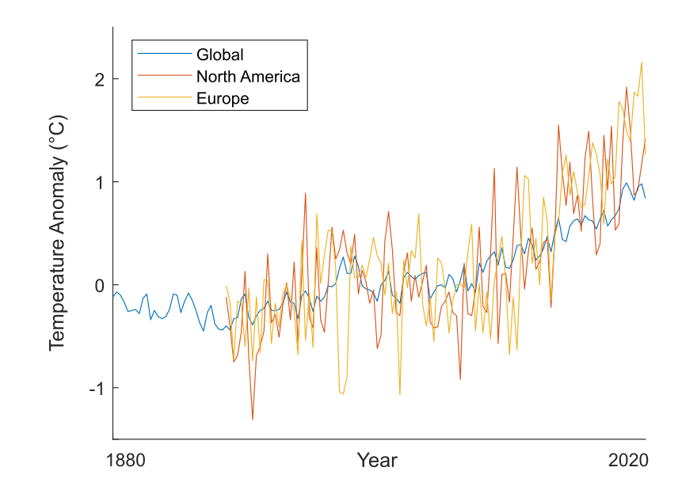
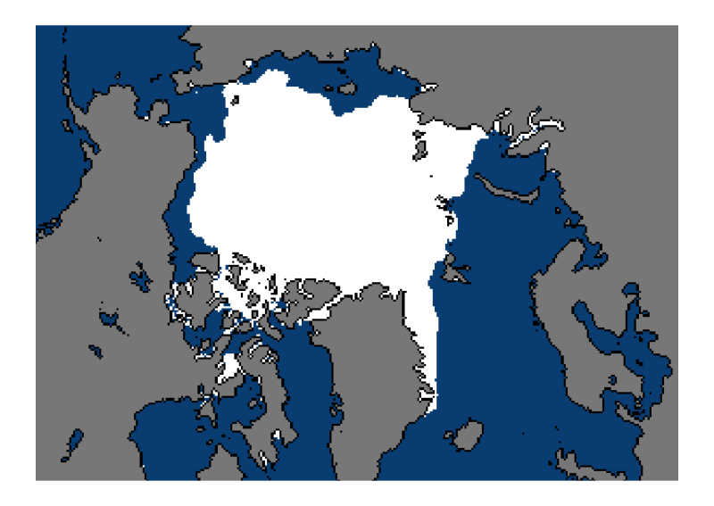
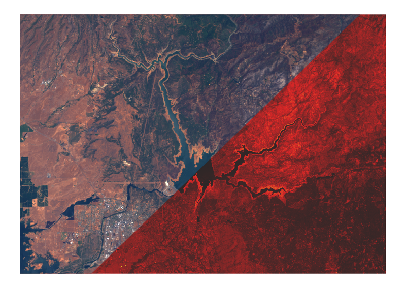
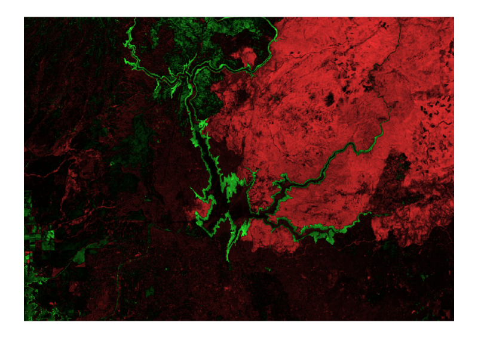
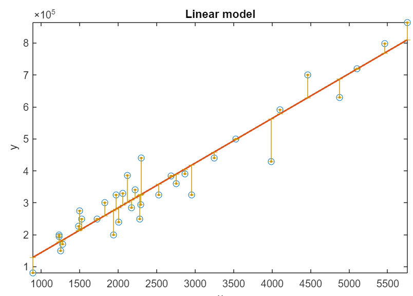

# Climate Data Visualization and Analysis

 or 

**Curriculum Module**

_Created with R2024a. Compatible with R2024a and later releases._

# Information

This curriculum module contains interactive [MATLAB® live scripts](https://www.mathworks.com/products/matlab/live-editor.html) that teach the basics of how to import, visualize, and analyze climate data using MATLAB.

## Background

You can use these live scripts as demonstrations in lectures, class activities, or interactive assignments outside class. This module covers importing, visualizing, and analyzing data. It also includes examples of analyzing temperature anomaly data and Arctic sea ice data, as well as using multispectral imaging data to characterize drought in Northern California.

The instructions inside the live scripts will guide you through the exercises and activities. Get started with each live script by running it one section at a time. To stop running the script or a section midway (for example, when an animation is in progress), use the  Stop button in the **RUN** section of the **Live Editor** tab in the MATLAB Toolstrip.

## Contact Us

Contact the [MathWorks teaching resources team](mailto:onlineteaching@mathworks.com) if you would like to provide feedback, or if you have a question.

## Prerequisites

This module assumes you have a basic understanding of MATLAB. If you do not, consider completing [<u>MATLAB Onramp</u>](https://matlabacademy.mathworks.com/details/matlab-onramp/gettingstarted) before starting this module.

## Getting Started
### Accessing the Module
### **On MATLAB Online:**

Use the  link to download the module. You will be prompted to log in or create a MathWorks account. The project will be loaded, and you will see an app with several navigation options to get you started.

### **On Desktop:**

Download or clone this repository. Open MATLAB, navigate to the folder containing these scripts and double\-click on [ClimateVis.prj](ClimateVis.prj). It will add the appropriate files to your MATLAB path and open an app that asks you where you would like to start. 

Ensure you have all the required products (listed below) installed. If you need to include a product, add it using the Add\-On Explorer. To install an add\-on, go to the **Home** tab and select   **Add-Ons** > **Get Add-Ons**. 

## Products

MATLAB® is used throughout. Tools from Image Processing Toolbox™, Statistics and Machine Learning Toolbox™, and Curve Fitting Toolbox™ are used as well.

# Scripts
## [**GlobalTemperature.mlx**](https://matlab.mathworks.com/open/github/v1?repo=MathWorks-Teaching-Resources/Climate-Data-Visualization-and-Analysis&project=ClimateVis.prj&file=Scripts/GlobalTemperature.mlx)
|      |      |
| :-- | :-- |
|     | **In this script, students will...**   $\bullet$ Load time\-series temperature data into MATLAB   $\bullet$ Compare regional temperature trends using time\-series plots   $\bullet$ Apply array indexing to compute changes to CO2 concentration   $\bullet$ Discuss correlation and autocorrelation of climate time\-series data     |
|      |       |

## [**ArcticSeaIce.mlx**](https://matlab.mathworks.com/open/github/v1?repo=MathWorks-Teaching-Resources/Climate-Data-Visualization-and-Analysis&project=ClimateVis.prj&file=Scripts/ArcticSeaIce.mlx)
|      |      |
| :-- | :-- |
|     | **In this script, students will...**   $\bullet$ Load and display Arctic sea ice extent GeoTIFF data   $\bullet$ Quantify Arctic sea ice extent using logical operators   $\bullet$ Use a for loop to analyze changes to Arctic sea ice from 1979 to 2021   $\bullet$ Compute the linear trend of Arctic sea ice extent     |
|      |       |

## [**MultispectralImaging.mlx**](https://matlab.mathworks.com/open/github/v1?repo=MathWorks-Teaching-Resources/Climate-Data-Visualization-and-Analysis&project=ClimateVis.prj&file=Scripts/MultispectralImaging.mlx)
|      |      |
| :-- | :-- |
|     | **In this script, students will...**   $\bullet$ List the spectral band designations for the Landsat 8 satellite   $\bullet$ Load and display single band images   $\bullet$ Use metadata to rescale a spectral band   $\bullet$ Create an RGB image from spectral bands     |
|      |       |

## [**MultispectralIndices.mlx**](https://matlab.mathworks.com/open/github/v1?repo=MathWorks-Teaching-Resources/Climate-Data-Visualization-and-Analysis&project=ClimateVis.prj&file=Scripts/MultispectralIndices.mlx)
|      |      |
| :-- | :-- |
|     | **In this script, students will...**   $\bullet$ Compute multispectral indices (NDVI and NDWI) from Landsat 8 data   $\bullet$ Analyze the reduction of reservoir area due to drought   $\bullet$ Superimpose a multispectral index on an RGB image   $\bullet$ Quantify changes to vegetation   $\bullet$ Apply image processing techniques, such as creating a binary mask and registering images     |
|      |       |

# License

The license for this module is available in the [LICENSE.md](https://github.com/MathWorks-Teaching-Resources/Climate-Data-Visualization-and-Analysis/blob/release/LICENSE.md).

# Related Courseware Modules
## [**Regression Basics**](https://www.mathworks.com/matlabcentral/fileexchange/93435-regression-basics)
|      |      |
| :-- | :-- |
|     | **Available on:**      [GitHub](https://github.com/MathWorks-Teaching-Resources/Regression-Basics)     |
|      |       |

## [**Machine Learning for Regression**](https://www.mathworks.com/matlabcentral/fileexchange/95903-machine-learning-for-regression)
|      |      |
| :-- | :-- |
|     | **Available on:**      [GitHub](https://github.com/MathWorks-Teaching-Resources/Machine-Learning-for-Regression)     |
|      |       |

## [**Machine Learning Methods: Clustering**](https://www.mathworks.com/matlabcentral/fileexchange/135381-machine-learning-methods-clustering)
|      |      |
| :-- | :-- |
|     | **Available on:**      [GitHub](https://github.com/MathWorks-Teaching-Resources/Machine-Learning-Methods-Clustering)     |
|      |       |

Or feel free to explore our other [modular courseware content](https://www.mathworks.com/matlabcentral/fileexchange/?q=tag%3A%22courseware+module%22&sort=downloads_desc_30d).

# Educator Resources
-  [Educator Page](https://www.mathworks.com/academia/educators.html) 

# Contribute 

Looking for more? Find an issue? Have a suggestion? Please contact the [MathWorks teaching resources team](mailto:%20onlineteaching@mathworks.com). If you want to contribute directly to this project, you can find information about how to do so in the [CONTRIBUTING.md](https://github.com/MathWorks-Teaching-Resources/Climate-Data-Visualization-and-Analysis/blob/release/CONTRIBUTING.md) page on GitHub.

 *©* Copyright 2024 The MathWorks™, Inc

